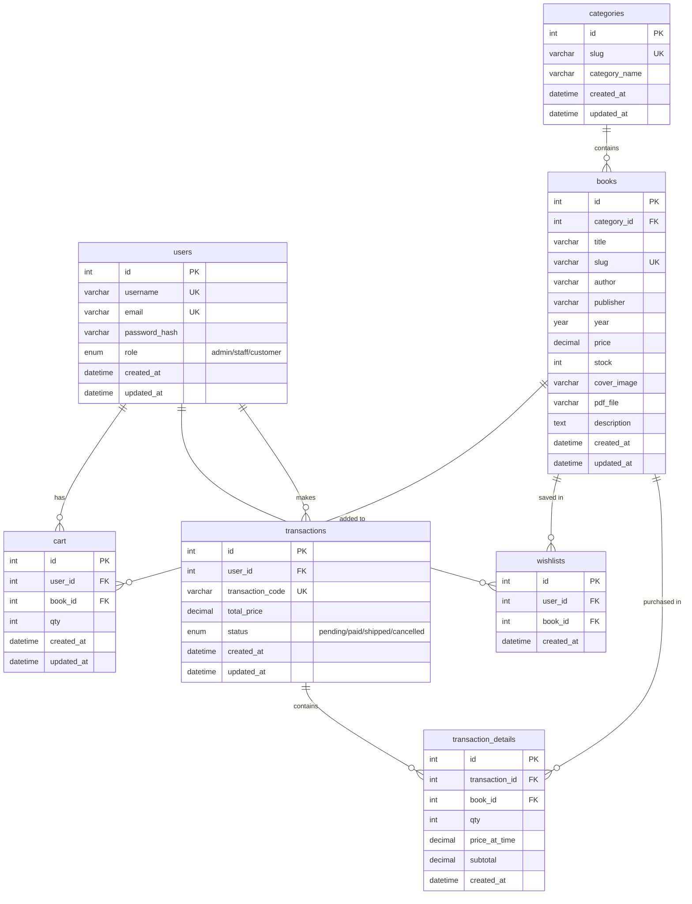
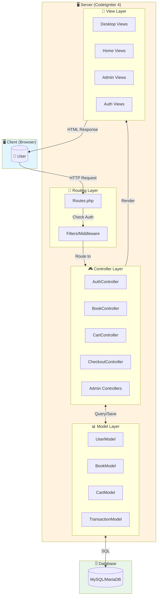
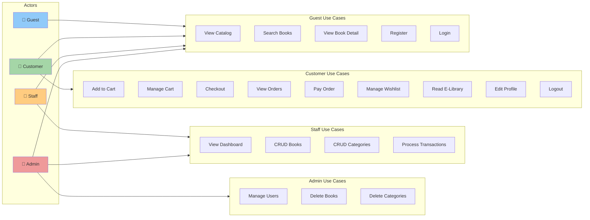
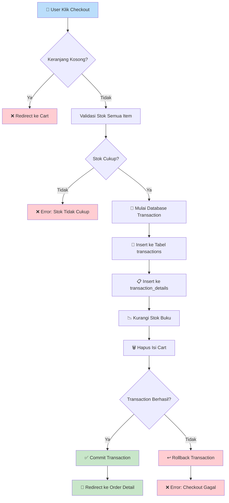
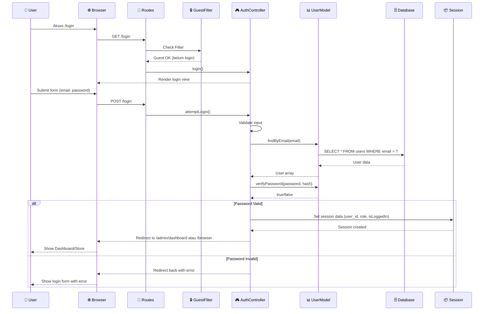
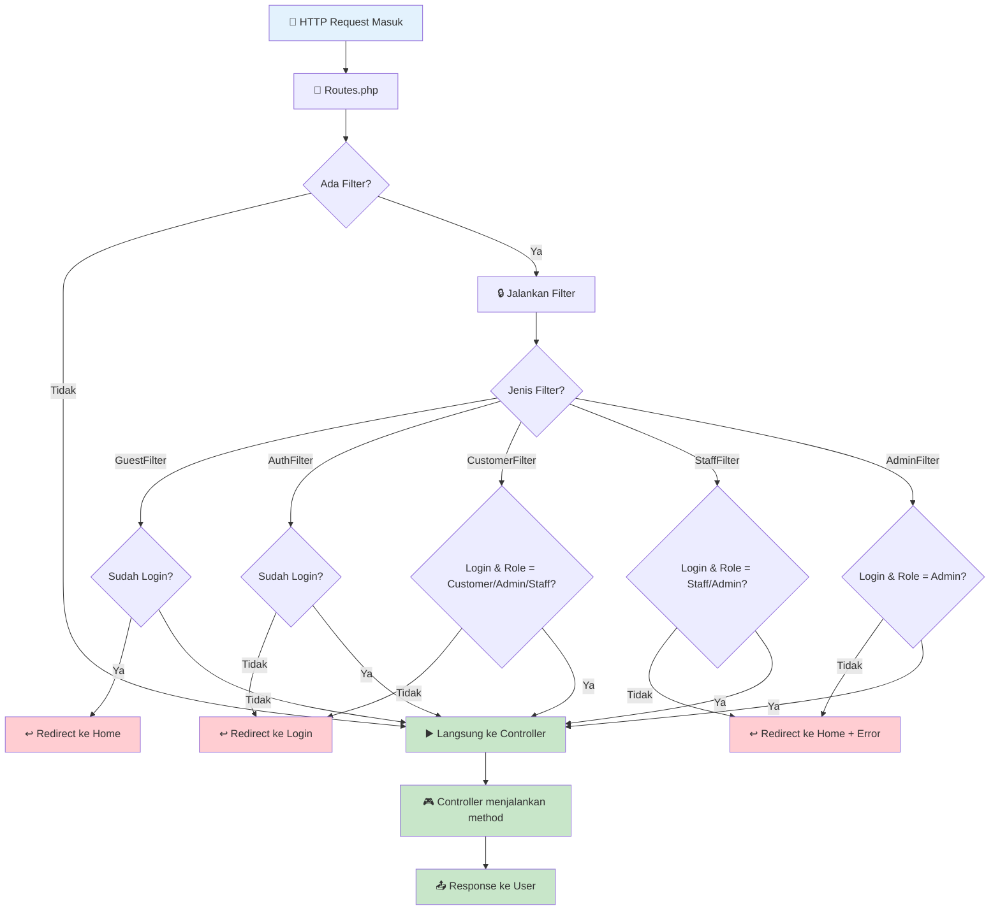
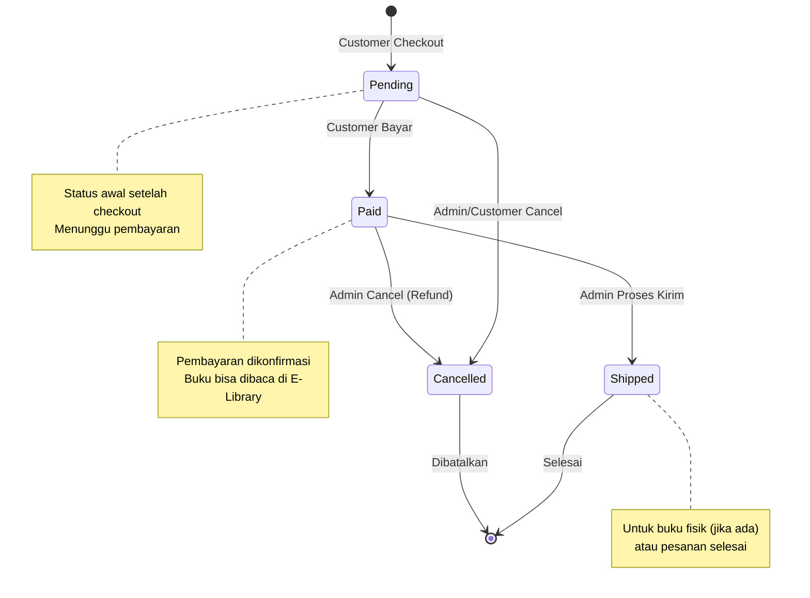
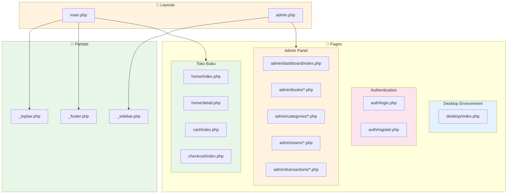

# 📚 BookOS - Sistem Manajemen Toko Buku Web-Based Desktop Environment

## 📖 Tentang Project

**BookOS** adalah aplikasi manajemen toko buku berbasis web yang unik karena mengadopsi antarmuka **Desktop Environment (Windows 11 Style)**. Tidak seperti website toko buku konvensional, aplikasi ini memberikan pengalaman pengguna seperti menggunakan sistem operasi desktop, lengkap dengan:

- **Lock Screen & Login Screen** yang interaktif
- **Desktop** dengan Wallpaper Bloom khas Windows 11
- **Taskbar** dan **Start Menu** yang fungsional
- **Window Management**: Aplikasi toko buku berjalan di dalam "window" browser virtual yang bisa diminimize/maximize

Project ini dibangun menggunakan **CodeIgniter 4** untuk backend yang robust dan **Tailwind CSS + Vanilla JS** untuk frontend yang modern dan responsif.

---

## 🚀 Fitur Utama

### 1. Desktop Environment (Frontend)

| Komponen        | Deskripsi                                               |
| --------------- | ------------------------------------------------------- |
| Lock Screen     | Layar kunci dengan blur effect dan animasi              |
| Sign In Screen  | Form login dengan avatar dan Welcome spinner            |
| Desktop         | Wallpaper Bloom, icons, dan area kerja                  |
| Taskbar         | Start button, search, system tray, clock                |
| Start Menu      | Menu dengan pinned apps dan recommended section         |
| Window System   | Browser virtual yang movable, resizable, minimize/maximize |

### 2. User Roles (Multi-Level Authentication)

Sistem memiliki **3 level akses** yang diimplementasikan menggunakan **Filters**:

| Role     | Akses                                                              |
| -------- | ------------------------------------------------------------------ |
| Admin    | CRUD Buku, Kategori, User. Manajemen Transaksi. Delete operations. |
| Staff    | CRUD Buku, Kategori. Manajemen Transaksi. (Tidak bisa delete/user management) |
| Customer | Cart, Checkout, Wishlist, E-Library, Profile, Order History.       |

### 3. Toko Buku (E-Commerce Features)

- **Katalog Buku**: Browsing buku berdasarkan kategori dengan pagination
- **Pencarian**: Search by title, author, publisher, atau category
- **Shopping Cart**: Menambah/mengurangi item ke keranjang belanja
- **Checkout System**: Proses pembelian dengan validasi stok
- **Wishlist**: Menyimpan buku yang diinginkan
- **Transaction History**: Melihat riwayat dan status pembelian
- **E-Library**: Membaca buku PDF yang sudah dibeli langsung di browser menggunakan PDF.js

### 4. Admin Panel

- **Dashboard**: Statistik ringkas toko (total buku, kategori, transaksi)
- **CRUD Buku**: Tambah, Edit, Hapus data buku dengan upload cover & PDF
- **CRUD Kategori**: Manajemen kategori buku dengan auto-generated slug
- **User Management**: Mengelola akun pengguna (Admin only)
- **Transaction Management**: Update status pesanan (Pending → Paid → Shipped → Cancelled)

---

## 🛠️ Teknologi yang Digunakan

| Layer      | Teknologi                                      |
| ---------- | ---------------------------------------------- |
| Backend    | CodeIgniter 4 (PHP 8.1+)                       |
| Database   | MySQL / MariaDB                                |
| Frontend   | HTML5, CSS3 (Tailwind CSS), JavaScript (Vanilla) |
| PDF Viewer | PDF.js (Mozilla)                               |
| Session    | CodeIgniter Session (File-based)               |
| Security   | Bcrypt Password Hashing, CSRF Protection       |

---

## 📁 Struktur Folder Project

```
toko_buku/
├── app/
│   ├── Config/           # Konfigurasi (Routes, Filters, Database)
│   ├── Controllers/      # Logic aplikasi (MVC - Controller)
│   │   ├── Admin/        # Controllers untuk admin panel
│   │   ├── AuthController.php
│   │   ├── CartController.php
│   │   ├── CheckoutController.php
│   │   ├── LibraryController.php
│   │   ├── WishlistController.php
│   │   └── ...
│   ├── Filters/          # Middleware untuk autentikasi
│   │   ├── AdminFilter.php
│   │   ├── StaffFilter.php
│   │   ├── CustomerFilter.php
│   │   ├── AuthFilter.php
│   │   └── GuestFilter.php
│   ├── Models/           # Database logic (MVC - Model)
│   │   ├── BookModel.php
│   │   ├── UserModel.php
│   │   ├── CartModel.php
│   │   ├── TransactionModel.php
│   │   └── ...
│   └── Views/            # Tampilan (MVC - View)
│       ├── admin/        # Views untuk admin panel
│       ├── auth/         # Login & Register
│       ├── cart/         # Keranjang belanja
│       ├── checkout/     # Proses checkout
│       ├── desktop/      # Desktop environment (Windows 11)
│       ├── home/         # Halaman toko buku
│       ├── layouts/      # Template layout
│       ├── library/      # E-Library (PDF reader)
│       └── partials/     # Komponen reusable
├── public/               # Assets (CSS, JS, Images)
├── db.sql                # Schema database lengkap
└── .env                  # Environment configuration
```

---

## 🗄️ Struktur Database

Database menggunakan **7 tabel utama** dengan relasi foreign key:

```
┌─────────────┐     ┌──────────────┐     ┌─────────────────────┐
│   users     │     │  categories  │     │       books         │
├─────────────┤     ├──────────────┤     ├─────────────────────┤
│ id (PK)     │     │ id (PK)      │     │ id (PK)             │
│ username    │     │ slug         │     │ category_id (FK)    │◄──┐
│ email       │     │ category_name│     │ title, slug         │   │
│ password_hash│    │ created_at   │     │ author, publisher   │   │
│ role (ENUM) │     │ updated_at   │     │ price, stock        │   │
│ created_at  │     └──────────────┘     │ cover_image, pdf    │   │
│ updated_at  │                          │ description         │   │
└─────────────┘                          └─────────────────────┘   │
      │                                            │               │
      │ 1:N                                        │               │
      ▼                                            │               │
┌─────────────┐     ┌──────────────┐               │               │
│    cart     │     │  wishlists   │               │               │
├─────────────┤     ├──────────────┤               │               │
│ id (PK)     │     │ id (PK)      │               │               │
│ user_id (FK)│     │ user_id (FK) │               │               │
│ book_id (FK)│────►│ book_id (FK) │───────────────┘               │
│ qty         │     │ created_at   │                               │
│ created_at  │     └──────────────┘                               │
└─────────────┘                                                    │
      │                                                            │
      │                                                            │
      ▼                                                            │
┌──────────────────┐     ┌────────────────────────┐                │
│  transactions    │     │  transaction_details   │                │
├──────────────────┤     ├────────────────────────┤                │
│ id (PK)          │     │ id (PK)                │                │
│ user_id (FK)     │     │ transaction_id (FK)    │                │
│ transaction_code │     │ book_id (FK)           │────────────────┘
│ total_price      │     │ qty                    │
│ status (ENUM)    │     │ price_at_time          │
│ created_at       │     │ subtotal               │
└──────────────────┘     └────────────────────────┘
```

### Penjelasan Tabel:

| Tabel                 | Fungsi                                                    |
| --------------------- | --------------------------------------------------------- |
| `users`               | Menyimpan data user (admin, staff, customer)              |
| `categories`          | Kategori buku (Fiksi, Non-Fiksi, Teknologi, dll)          |
| `books`               | Katalog buku dengan relasi ke kategori                    |
| `cart`                | Keranjang belanja sementara (user_id + book_id unique)    |
| `wishlists`           | Daftar buku favorit user                                  |
| `transactions`        | Header transaksi (kode, total, status)                    |
| `transaction_details` | Detail item per transaksi (snapshot harga saat pembelian) |

---

## 📊 Diagram-Diagram Project

### 1. Entity Relationship Diagram (ERD)



---

### 2. Arsitektur MVC (Model-View-Controller)



---

### 3. Use Case Diagram



---

### 4. Flowchart Proses Checkout



---

### 5. Sequence Diagram: Proses Login



---

### 6. Flowchart Filter/Middleware



---

### 7. State Diagram: Status Transaksi



---

### 8. Component Diagram: Struktur Views



---

## ⚙️ Cara Instalasi & Menjalankan

### 1. Requirements

- PHP 8.1 atau lebih baru
- Composer
- Database: MySQL atau MariaDB
- Web Server: Apache/Nginx (opsional, bisa pakai built-in PHP server)

### 2. Setup Database

1. Buka PHPMyAdmin atau SQL Client
2. Buat database baru bernama `db_tokobuku`
3. Import file `db.sql` yang ada di root project

### 3. Konfigurasi Environment

1. Copy file `env` menjadi `.env`:
   ```bash
   cp env .env
   ```
2. Edit file `.env`, sesuaikan bagian database:
   ```env
   CI_ENVIRONMENT = development

   database.default.hostname = localhost
   database.default.database = db_tokobuku
   database.default.username = root
   database.default.password = 
   database.default.DBDriver = MySQLi
   ```

### 4. Jalankan Aplikasi

1. Install dependencies (jika ada update library):
   ```bash
   composer install
   ```
2. Jalankan server development:
   ```bash
   php spark serve
   ```
3. Buka browser: `http://localhost:8080`

---

## 🔐 Akun Default (Login)

Database `db.sql` sudah menyertakan akun default untuk testing:

| Role  | Username | Email              | Password   |
| ----- | -------- | ------------------ | ---------- |
| Admin | admin    | admin@tokobuku.com | `admin123` |
| Staff | staff    | staff@tokobuku.com | `admin123` |

> **Note**: Untuk register customer baru, silakan gunakan fitur Register di halaman login.

---

## 🎓 Persiapan Tanya Jawab Dosen (Cheat Sheet)

Berikut adalah kemungkinan pertanyaan dosen dan cara menjawabnya:

---

### 🔵 ARSITEKTUR & DESIGN PATTERN

#### Q: Jelaskan arsitektur aplikasi ini!

> **A:** Aplikasi ini menggunakan pola **MVC (Model-View-Controller)** dengan framework CodeIgniter 4.
>
> - **Model** (`app/Models/`): Mengurus interaksi dengan database. Contoh: `BookModel` untuk query ke tabel `books`, `UserModel` untuk tabel `users`.
> - **View** (`app/Views/`): Mengurus tampilan/UI. Menggunakan PHP murni yang dicampur dengan HTML dan Tailwind CSS.
> - **Controller** (`app/Controllers/`): Menghubungkan Model dan View. Menerima request dari user, memproses logic, memanggil Model untuk data, lalu mengirim ke View.

#### Q: Apa itu CodeIgniter 4?

> **A:** CodeIgniter 4 adalah framework PHP yang menggunakan arsitektur MVC. CI4 dipilih karena:
>
> - Ringan dan cepat (lightweight)
> - Dokumentasi lengkap
> - Built-in security features (CSRF, XSS filtering)
> - Session management yang mudah
> - Query Builder untuk database operations

#### Q: Kenapa tidak pakai Laravel?

> **A:** CodeIgniter lebih ringan dan sederhana untuk project skala ini. Laravel memiliki lebih banyak fitur, tapi juga lebih kompleks dan berat. Untuk toko buku dengan fitur standard, CI4 sudah sangat memadai.

---

### 🔵 KEAMANAN (SECURITY)

#### Q: Bagaimana cara kamu menangani keamanan login?

> **A:** Saya menerapkan beberapa layer keamanan:
>
> 1. **Password Hashing**: Password di-hash menggunakan `password_hash()` dengan algoritma **Bcrypt** (`PASSWORD_DEFAULT`). Password asli tidak pernah disimpan di database.
> 2. **Session Management**: Data login disimpan di session menggunakan `session()->set()`. Session di CI4 sudah terenkripsi.
> 3. **Filter/Middleware**: Setiap route diproteksi menggunakan Filter (`app/Filters/`) yang mengecek session dan role user.
>
> **Contoh kode hashing di `UserModel.php`:**
>
> ```php
> protected function hashPassword(array $data): array
> {
>     if (isset($data['data']['password'])) {
>         $data['data']['password_hash'] = password_hash($data['data']['password'], PASSWORD_DEFAULT);
>         unset($data['data']['password']); // Hapus password plain text
>     }
>     return $data;
> }
> ```

#### Q: Apa itu Filter? Bagaimana cara kerjanya?

> **A:** Filter adalah middleware di CodeIgniter 4 yang dijalankan **sebelum** atau **sesudah** request masuk ke Controller.
>
> **Contoh `AdminFilter.php`:**
>
> ```php
> public function before(RequestInterface $request, $arguments = null)
> {
>     $session = session();
>     
>     // Cek apakah sudah login
>     if (!$session->get('isLoggedIn')) {
>         return redirect()->to('/login');
>     }
>     
>     // Cek apakah role-nya admin
>     if ($session->get('role') !== 'admin') {
>         return redirect()->to('/')->with('error', 'Akses ditolak.');
>     }
> }
> ```
>
> **Penggunaannya di `Routes.php`:**
>
> ```php
> $routes->group('admin', ['filter' => 'admin'], function($routes) {
>     $routes->get('users', 'Admin\UserController::index');
> });
> ```

#### Q: Bagaimana mencegah SQL Injection?

> **A:** Saya menggunakan **Query Builder** dari CodeIgniter yang otomatis melakukan escaping parameter. Contoh:
>
> ```php
> // AMAN - Query Builder
> $this->bookModel->where('id', $id)->first();
>
> // TIDAK AMAN - Raw query tanpa binding
> // $db->query("SELECT * FROM books WHERE id = " . $id);
> ```

---

### 🔵 ALUR BISNIS (BUSINESS LOGIC)

#### Q: Bagaimana alur checkout-nya?

> **A:** Alur checkout menggunakan **Database Transaction** untuk menjamin konsistensi data:
>
> 1. User menambah buku ke **Cart** (tabel `cart`)
> 2. User klik **Checkout**, sistem validasi stok semua item
> 3. **Mulai Transaction**: `$db->transStart()`
> 4. **Insert** ke tabel `transactions` (header order)
> 5. **Insert** ke tabel `transaction_details` (item-item buku)
> 6. **Kurangi stok** buku di tabel `books`
> 7. **Hapus** isi cart user
> 8. **Commit Transaction**: `$db->transComplete()`
>
> Jika ada error di tengah proses, semua perubahan akan di-**rollback**.
>
> **Kode di `CheckoutController.php`:**
>
> ```php
> $db = \Config\Database::connect();
> $db->transStart();
> try {
>     $this->transactionModel->insert($transactionData);
>     $this->detailModel->createFromCart($transactionId, $cartItems);
>     foreach ($cartItems as $item) {
>         $this->bookModel->reduceStock($item['book_id'], $item['qty']);
>     }
>     $this->cartModel->clearCart($userId);
>     $db->transComplete();
> } catch (\Exception $e) {
>     $db->transRollback();
> }
> ```

#### Q: Kenapa pakai `price_at_time` di transaction_details?

> **A:** Untuk menyimpan **snapshot harga** saat pembelian. Jika harga buku berubah di kemudian hari, riwayat transaksi tetap menampilkan harga asli saat user membeli. Ini penting untuk:
>
> - Akurasi laporan keuangan
> - Bukti transaksi yang valid
> - Audit trail

---

### 🔵 DATABASE

#### Q: Jelaskan relasi antar tabel!

> **A:**
>
> - **users ↔ cart**: One-to-Many (1 user punya banyak item cart)
> - **users ↔ wishlists**: One-to-Many (1 user punya banyak wishlist)
> - **users ↔ transactions**: One-to-Many (1 user punya banyak transaksi)
> - **categories ↔ books**: One-to-Many (1 kategori punya banyak buku)
> - **books ↔ cart**: One-to-Many (1 buku bisa di banyak cart user)
> - **books ↔ transaction_details**: One-to-Many (1 buku bisa di banyak transaksi)
> - **transactions ↔ transaction_details**: One-to-Many (1 transaksi punya banyak detail item)

#### Q: Apa itu Foreign Key? Kenapa penting?

> **A:** Foreign Key adalah constraint yang memastikan nilai di kolom tertentu harus ada di tabel referensinya. Contoh:
>
> ```sql
> FOREIGN KEY (category_id) REFERENCES categories(id) ON DELETE RESTRICT
> ```
>
> Artinya: `category_id` di tabel `books` harus ada di tabel `categories`. Jika kategori dihapus padahal masih ada buku yang mereferensi, database akan **menolak** (`RESTRICT`).

#### Q: Kenapa pakai ENUM untuk role dan status?

> **A:** ENUM membatasi nilai yang bisa dimasukkan, sehingga:
>
> - Mencegah typo atau nilai tidak valid
> - Self-documenting (langsung terlihat nilai yang diperbolehkan)
> - Performa lebih baik daripada string biasa
>
> ```sql
> role ENUM('admin', 'staff', 'customer')
> status ENUM('pending', 'paid', 'shipped', 'cancelled')
> ```

---

### 🔵 ROUTING & URL

#### Q: Apa itu Routing? Di mana file-nya?

> **A:** Routing adalah pemetaan URL ke Controller. File-nya ada di `app/Config/Routes.php`.
>
> **Contoh:**
>
> ```php
> // URL /book/laskar-pelangi akan memanggil Home::detail('laskar-pelangi')
> $routes->get('/book/(:segment)', 'Home::detail/$1');
>
> // URL /admin/books/edit/5 akan memanggil Admin\BookController::edit(5)
> $routes->get('books/edit/(:num)', 'Admin\BookController::edit/$1');
> ```
>
> - `(:segment)` = menangkap string apapun (untuk slug)
> - `(:num)` = menangkap angka saja (untuk ID)

#### Q: Apa bedanya route group dengan filter?

> **A:** Route group mengelompokkan URL dengan prefix yang sama, sementara filter menambahkan middleware. Contoh:
>
> ```php
> $routes->group('admin', ['filter' => 'staff'], function($routes) {
>     // Semua URL di dalam ini akan diawali /admin/...
>     // dan harus melewati StaffFilter terlebih dahulu
>     $routes->get('books', 'Admin\BookController::index');    // /admin/books
>     $routes->get('categories', 'Admin\CategoryController::index'); // /admin/categories
> });
> ```

---

### 🔵 FRONTEND & UI

#### Q: Kenapa tampilan awalnya masuk ke Desktop dulu, bukan langsung daftar buku?

> **A:** Ini adalah konsep **Web-based OS** yang saya eksplorasi untuk memberikan pengalaman unik. Website toko buku diperlakukan sebagai "aplikasi" yang berjalan di dalam simulasi OS Windows 11. Secara teknis:
>
> - URL `/` menampilkan Desktop Environment
> - URL `/browser` menampilkan Toko Buku (bisa diakses langsung atau via window di desktop)
> - Ini menunjukkan kemampuan frontend dengan CSS/JS yang kompleks

#### Q: Framework CSS apa yang dipakai?

> **A:** **Tailwind CSS** - utility-first CSS framework. Dipilih karena:
>
> - Cepat dalam prototyping
> - Tidak perlu menulis CSS custom untuk setiap komponen
> - Responsive design mudah dengan prefix seperti `md:`, `lg:`
> - File CSS final bisa di-purge sehingga ukuran kecil

---

### 🔵 FITUR KHUSUS

#### Q: Bagaimana cara kerja E-Library?

> **A:** E-Library menggunakan **PDF.js** (library dari Mozilla) untuk menampilkan PDF di browser:
>
> 1. Saat user checkout, buku yang dibeli dicatat di `transaction_details`
> 2. Di halaman Library, sistem query buku yang sudah dibeli user dan status transaksi = 'paid'
> 3. User klik "Baca", sistem memanggil `PdfController::view($bookId)`
> 4. Controller validasi apakah user sudah membeli buku tersebut
> 5. Jika valid, PDF di-stream ke browser dan ditampilkan dengan PDF.js
>
> Hal ini mencegah user membaca buku yang belum dibeli.

#### Q: Kenapa pakai slug untuk URL buku?

> **A:** Slug adalah versi URL-friendly dari judul. Contoh:
>
> - Judul: "Clean Code: A Handbook of Agile Software"
> - Slug: `clean-code-a-handbook-of-agile-software`
>
> Keuntungan:
>
> - **SEO-friendly**: URL `/book/clean-code` lebih baik daripada `/book/123`
> - **Readable**: User bisa tahu isi halaman dari URL-nya
> - **Unique**: Slug di-generate dari title dan dijamin unique

---

### 🔵 PERTANYAAN TEKNIS LANJUTAN

#### Q: Apa itu Callback di Model?

> **A:** Callback adalah function yang otomatis dipanggil pada event tertentu. Di CodeIgniter 4:
>
> ```php
> protected $beforeInsert = ['hashPassword'];  // Dipanggil sebelum insert
> protected $beforeUpdate = ['hashPassword'];  // Dipanggil sebelum update
> ```
>
> Saya pakai ini untuk otomatis hash password setiap kali data user di-insert/update.

#### Q: Bagaimana validasi form di backend?

> **A:** Validasi dilakukan di Controller menggunakan `$this->validate()`:
>
> ```php
> $rules = [
>     'email'    => 'required|valid_email',
>     'password' => 'required|min_length[6]',
> ];
>
> if (!$this->validate($rules)) {
>     return redirect()->back()->withInput()->with('errors', $this->validator->getErrors());
> }
> ```
>
> Rule yang tersedia: `required`, `valid_email`, `min_length[n]`, `max_length[n]`, `is_unique[table.field]`, `matches[field]`, dll.

#### Q: Apa bedanya `$this->request->getPost()` dengan `$_POST`?

> **A:** `$this->request->getPost()` adalah cara CodeIgniter untuk mengambil data POST dengan tambahan:
>
> - Otomatis sanitasi/filtering
> - Return null jika key tidak ada (bukan notice error)
> - Lebih aman dari XSS

---

## 📝 Catatan Penting untuk Presentasi

1. **Jalankan aplikasi** sebelum presentasi untuk demo live
2. **Siapkan Postman/browser** untuk demo API jika ditanya
3. **Buka phpMyAdmin** untuk menunjukkan struktur database
4. **Login sebagai Admin dan Customer** untuk demo fitur berbeda
5. **Booking buku** untuk demo alur checkout sampai E-Library

---

## 📄 Lisensi

MIT License - Silakan gunakan untuk pembelajaran.

---

**Dibuat dengan ❤️ menggunakan CodeIgniter 4**
